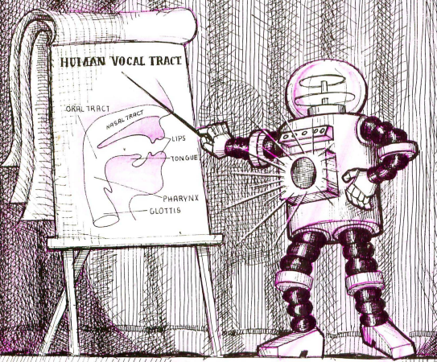

Hello! My name is Paul. I am a software engineer. I teach computers how to sing.

Notable Work:

- [HandsFreeSoundJam](https://github.com/PaulBatchelor/HandsFreeSoundJam): create music
using only your eyes. Originally built with the Enable Group at Microsoft Research to explore
new interfaces for musicians with ALS. Part of the winnning submission to the 21st SXSW Innovation Award
for Music Innovation. [website](https://www.microsoft.com/en-us/research/project/microsoft-hands-free-sound-jam/).

- [Voc](https://github.com/PaulBatchelor/voc): Physical model of the human vocal tract, written
in ANSI C using [literate programming](https://en.wikipedia.org/wiki/Literate_programming). Adapted from Neil Thapen's Pink Trombone. [website](https://paulbatchelor.github.io/proj/voc/).

- [Orb](https://github.com/PaulBatchelor/Orb): A 2d musical puzzle game for Android featuring
procedurally generated music and audio synthesis. [website](https://paulbatchelor.github.io/proj/orb/)

- [sndkit](https://github.com/PaulBatchelor/sndkit): A collection of highly portable DSP algorithms,
written in ANSI C using a [literate programming](https://en.wikipedia.org/wiki/Literate_programming)
style. [website](https://paulbatchelor.github.io/sndkit)

- [vocshape](https://github.com/PaulBatchelor/vocshape): A simple android app demonstrating
the shaping capabilities of articulatory synthesis using realtime audio. [website](https://paulbatchelor.github.io/wiki/vocshape/)

More projects can be found on [my project page](https://paulbatchelor.github.io/proj).
